# KVCache Benchmark Results (2025-08-22)

我们主要对以下4种场景进行了压测：

| 编号| Offloading 方式 |  带宽  |     ARCC 开启     |
| --- | ----------- | ----- | -------------------- |
| 1  |   No KVCache |  N/A          |       N      |
| 2  |   CPU        |  N/A          |       N      |
| 3  |   Local Disk |  100Gbps      |       Y      |
| 4  |   Local Disk |  200Gbps      |       Y      |
| 5  |   GDS        |  100Gbps      |       Y      |

## 部署参数

除了硬件上的差异，我们采用相同的部署参数来进行压测

- vLLM 通用参数：TP=8，关闭前缀缓存，使用LMCacheConnectorV1 (--tensor-parallel-size 8 --no-enable-prefix-caching --disable-log-requests -kv-transfer-config '{\"kv_connector\":\"LMCacheConnectorV1\", \"kv_role\":\"kv_both\"}')
- LMCache：chunk_size=256，**max_local_cpu_size=50.0**

更详细信息可以参考： [auto_benchmark.sh](../tools/auto_benchmark.sh)

## 压测参数

我们使用vllm benchmarks/benchmark_serving.py 来进行压测，每组部署配置测试三轮，使用Random数据集和固定的Seed（以保证每轮tokens相同），其他压测参数如下：

- 并发数：16
- 输入长度：100/1k/10k/50k/100k
- **输出长度：20**
- **迭代数：20**

(作为参考，全部压测完生成的kv cache大约是1.1TB)

更多详细信息可以参考： [run.sh](../tools/run.sh)

## 结果

| 编号| mean ttft (ms) | mean itl(ms)  |    total token throughput(tok/s)     |
| --- | ----------- | ----- | -------------------- |
| 1  |   |  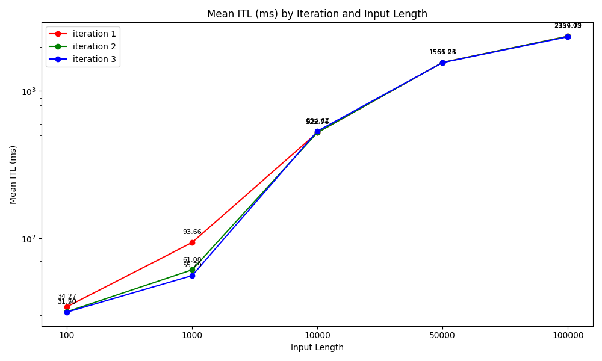        |      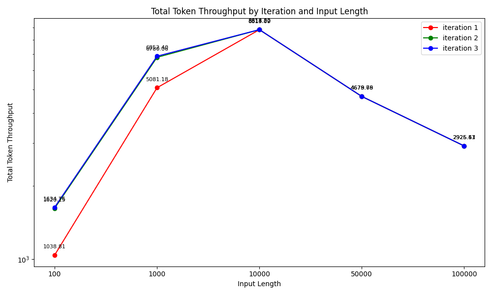     |
| 2  |  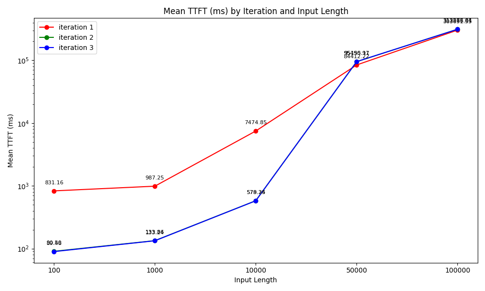 |            |      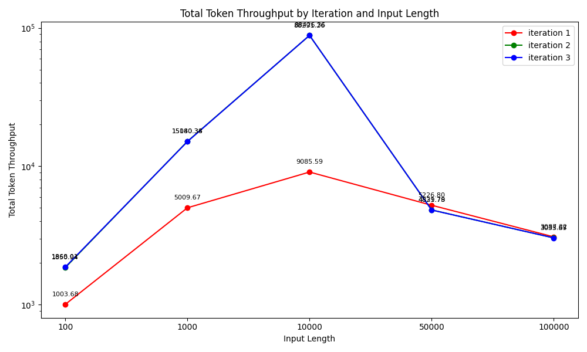     |
| 3  |  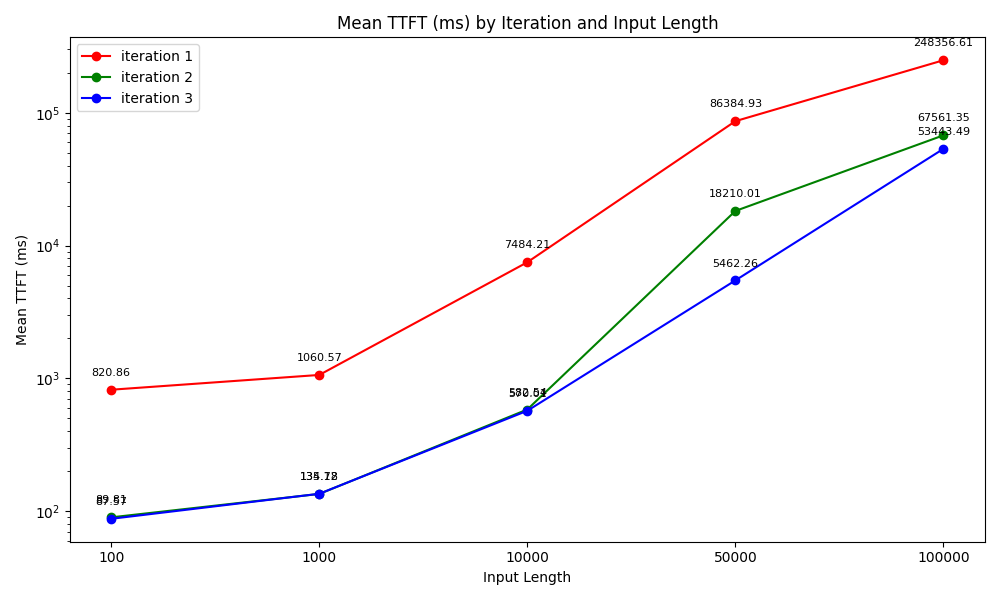 | 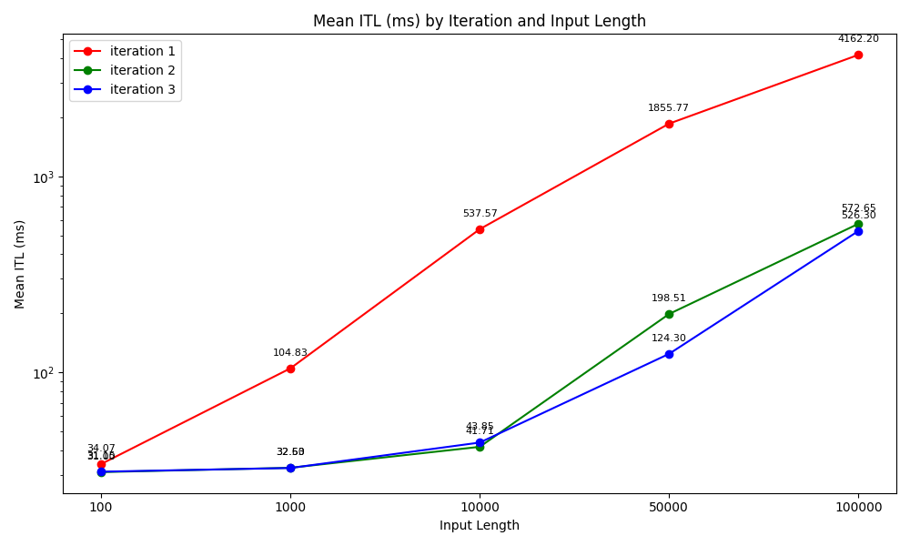  |   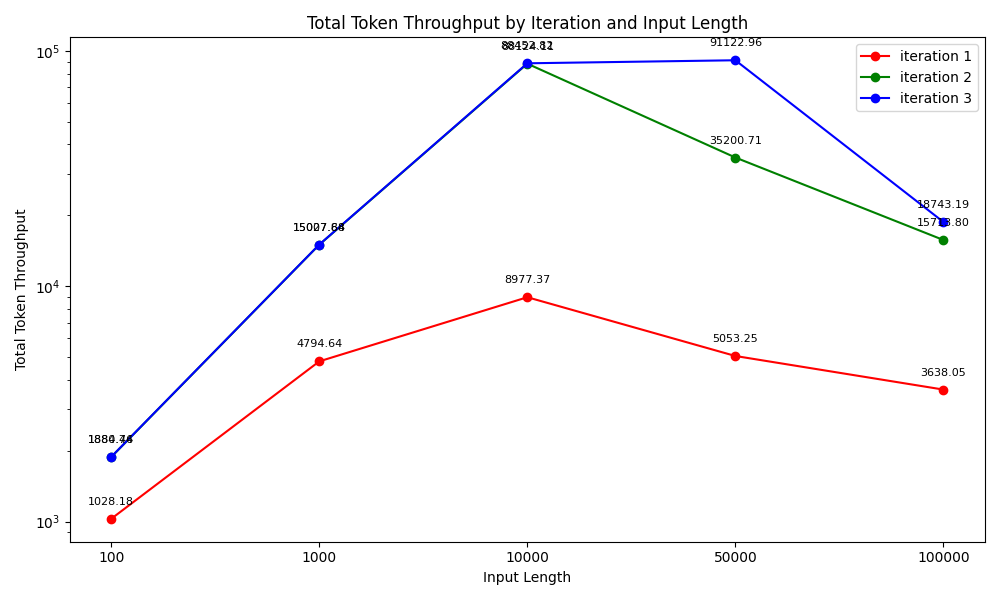      |
| 4  |    |  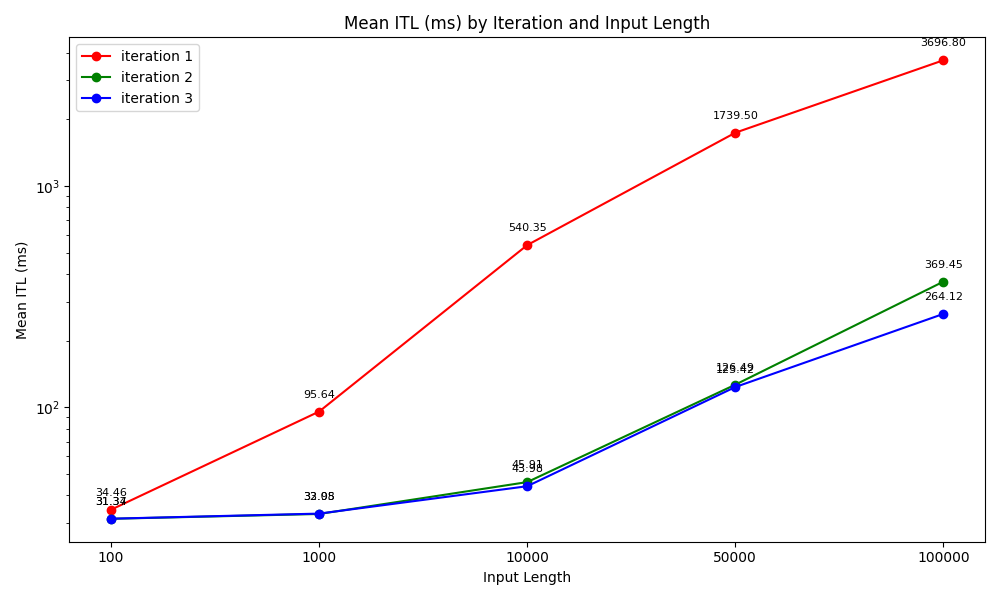 | 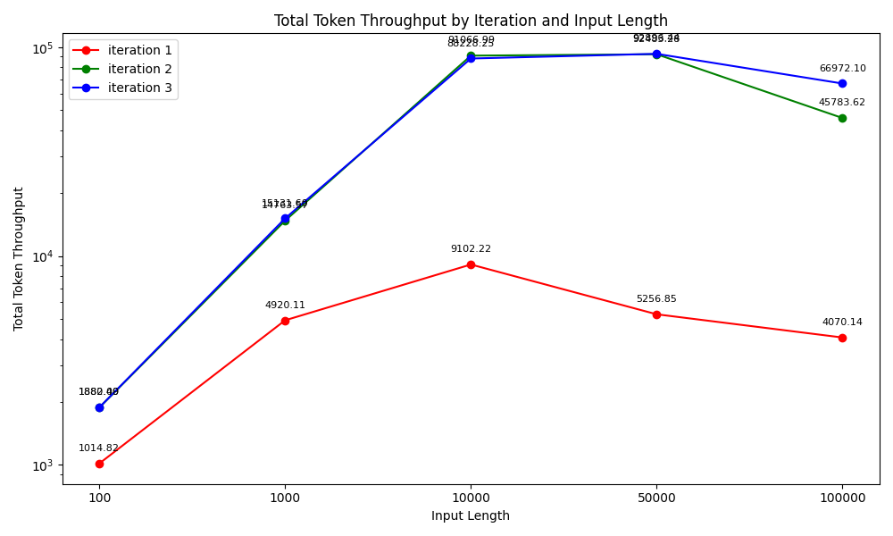 |
| 5  |   | 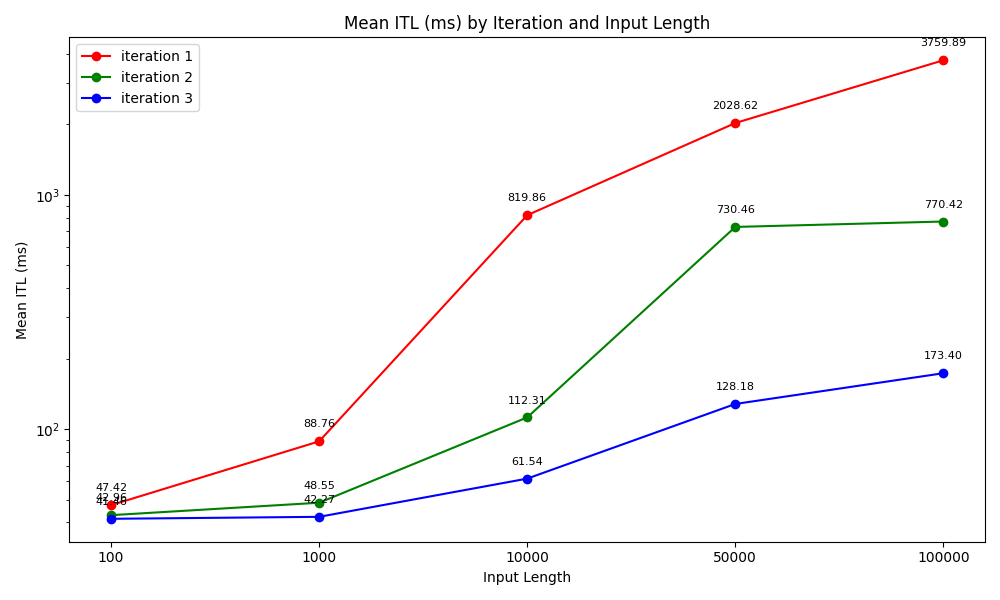 | 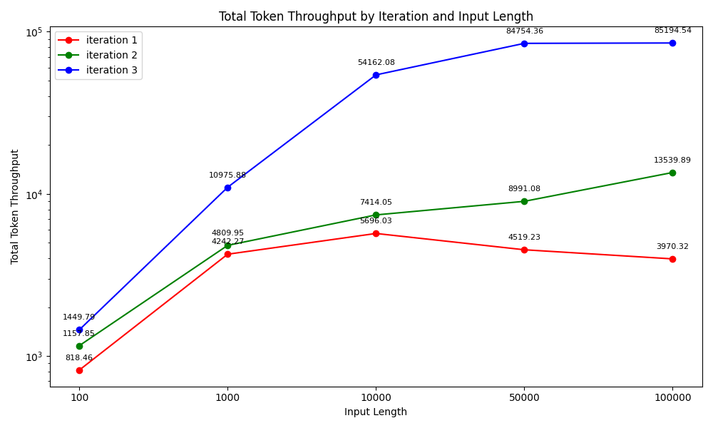   |
